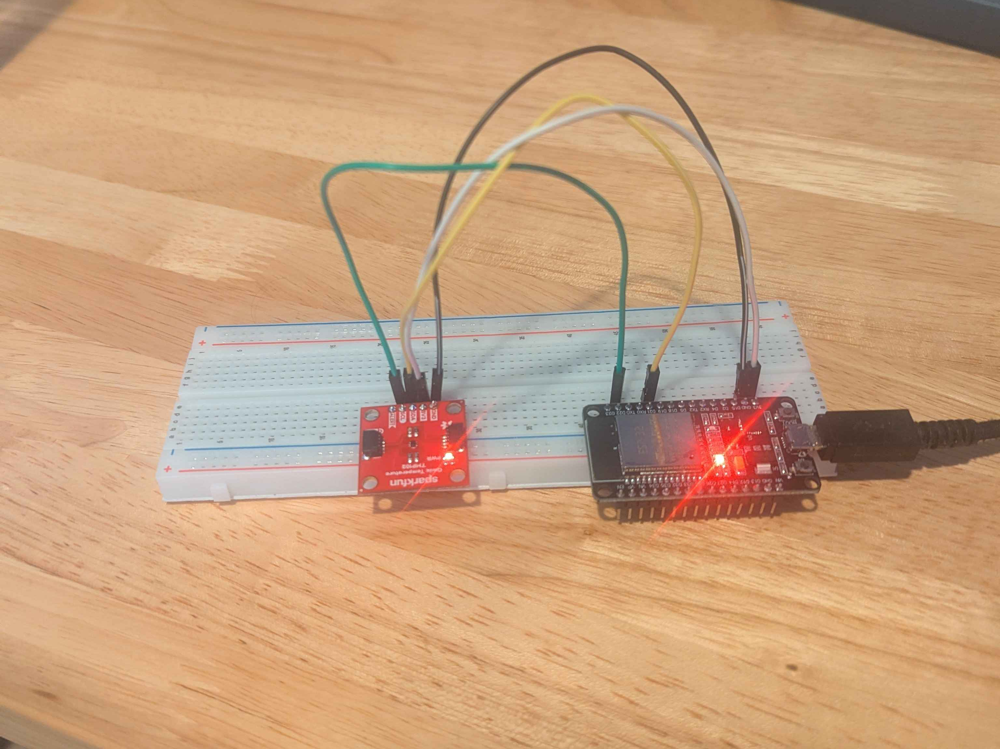
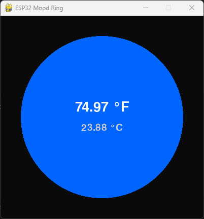
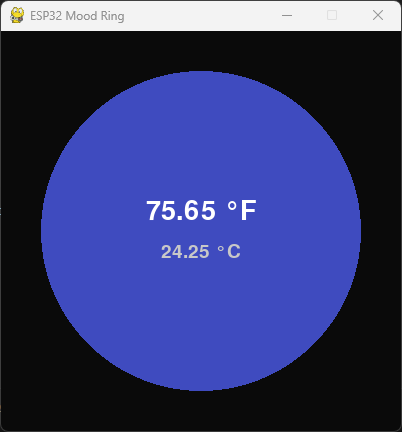
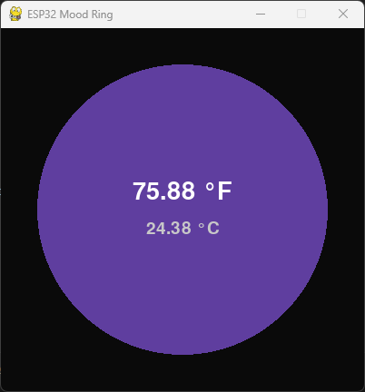
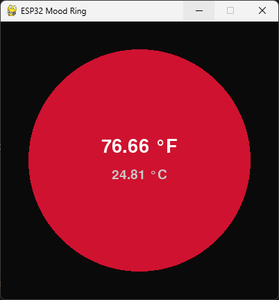
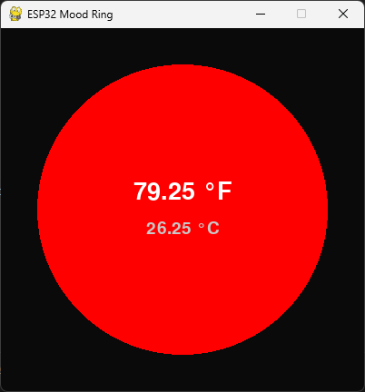

# Temperature Visualizer using ESP-32 and Python

## Overview

This project uses a sensor to read the current temperature and shows it on a display using Pygame similar to a mood ring. The temperature is read using a TMP102 sensor connected through I2C to an ESP32. The data is then transmitted over BLE using notifications and read only access using custom service and characteristic UUIDs. There is also a write access LED service on the ESP32 which was created during my learning of BLE and was tested using nRF Connect. This project was very helpful in learning how the BLE protocol works, covering stack components like the host and controller layers, GAP, GATT, and how BLE packets look and are transmitted/received.

Here is what the Python script shows as temperature changes.

